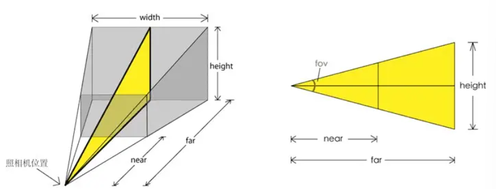
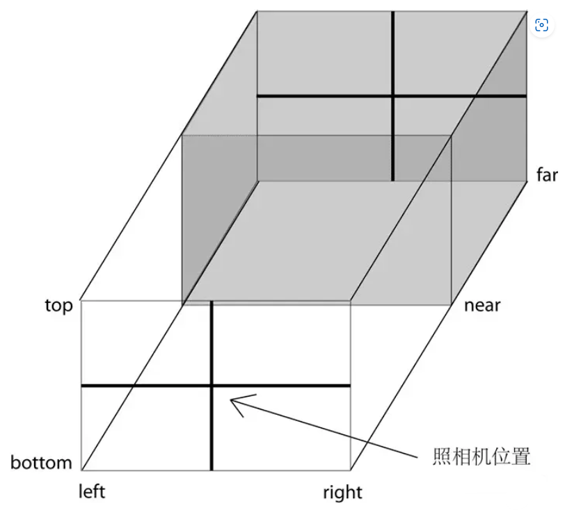

# 2. camera
Camera 再 threejs 裡是一個類，不能直接使用，要藉由其他類型的 camera 來實現這個抽象類，分別有

1. ArrayCamera 
2. StereoCamera
3. CubeCamera
4. OrthographicCamera
5. PerspectiveCamera

## 1. PerspectiveCamera 透視相機
`PerspectiveCamera(fov : Number, aspect : Number, near : Number, far : Number)`

* fov: camera 視錐體垂直角度視野
* aspect: camera 視錐體長寬比
* near: camera 能到看多近
* far: camera 能看多遠



要注意 near 和 far 不要設置太極端的值，例如 0.00001 和 99999，這可能會讓 threejs 無法分辨物體的前後，導致閃動 bug

## 2. OrthographicCamera 正交相機
`OrthographicCamera( left : Number, right : Number, top : Number, bottom : Number, near : Number, far : Number )`

* left — 攝像機視錐體左側面。
* right — 攝像機視錐體右側面。
* top — 攝像機視錐體上側面。
* bottom — 攝像機視錐體下側面。
* near — 攝像機視錐體近端面。
* far — 攝像機視錐體遠端面。



為了保持 camera 的橫豎比例，需要保證 (rigth - left) 和 (top -bottom) 的比例與 canvas 比例一樣
```js
import * as THREE from 'three';

/**
 * Base
 */
// canvas
const canvas = document.querySelector('canvas') as HTMLCanvasElement;
const size = {
  width: canvas.clientWidth,
  heigth: canvas.clientHeight,
};

// Scene
const scene = new THREE.Scene();

// Object
const geometry = new THREE.BoxGeometry(1, 1, 1);
const material = new THREE.MeshBasicMaterial({
  color: 0xff0000,
});
const cube = new THREE.Mesh(geometry, material);
scene.add(cube);

// Camera
const aspectRatio: number = size.width / size.heigth;
const camera = new THREE.OrthographicCamera(
  -1 * aspectRatio,
  1 * aspectRatio,
  1,
  -1,
  1,
  100
);
camera.position.set(0, 0, 3);
camera.lookAt(cube.position);

// Renderer
const renderer = new THREE.WebGLRenderer({ canvas });
renderer.setSize(canvas.clientWidth, canvas.clientHeight);

// Clock
const clock = new THREE.Clock();

// Animation
const tick = () => {
  // Clock
  const elapsedTime = clock.getElapsedTime();
  cube.rotation.y = elapsedTime;

  renderer.render(scene, camera);
  window.requestAnimationFrame(tick);
};

tick()
```

## 3. 控制相機移動
```ts
import * as THREE from 'three';

// canvas
interface ISize {
  width: number;
  height: number;
}
const canvas = document.querySelector('canvas') as HTMLCanvasElement;
const size:ISize = {
  width: canvas.clientWidth,
  height: canvas.clientHeight,
};

/**
 * Cursor
 */
interface ICursor {
  x: number;
  y: number;
}
const cursor:ICursor = {
  x: 0,
  y: 0
}
window.addEventListener('mousemove', (e:MouseEvent) => {
  cursor.x = e.clientX / size.width - 0.5;
  cursor.y = -(e.clientY / size.height - 0.5);
})

/**
 * Base
 */
// Scene
const scene = new THREE.Scene();

// Object
const geometry = new THREE.BoxGeometry(1, 1, 1);
const material = new THREE.MeshBasicMaterial({
  color: 0xff0000,
});
const cube = new THREE.Mesh(geometry, material);
scene.add(cube);

// Camera
const aspectRatio: number = size.width / size.height;
const camera: THREE.PerspectiveCamera = new THREE.PerspectiveCamera(75, size.width/size.height)
camera.position.set(0, 0, 3);
camera.lookAt(cube.position);

// Renderer
const renderer = new THREE.WebGLRenderer({ canvas });
renderer.setSize(canvas.clientWidth, canvas.clientHeight);

// Clock
const clock = new THREE.Clock();

// Animation
const tick = () => {
  // Clock
  const elapsedTime = clock.getElapsedTime();
  cube.rotation.y = elapsedTime;

  // Camera
  camera.position.x = cursor.x * 8;
  camera.position.y = cursor.y * 8;
  camera.lookAt(cube.position)

  renderer.render(scene, camera);
  window.requestAnimationFrame(tick);
};

tick()
```

## 4. threejs 內置的控制器
```ts
import * as THREE from 'three'; 
import { OrbitControls } from 'three/examples/jsm/controls/OrbitControls';

// canvas
interface ISize {
  width: number;
  height: number;
}
const canvas = document.querySelector('canvas') as HTMLCanvasElement;
const size:ISize = {
  width: canvas.clientWidth,
  height: canvas.clientHeight,
};

/**
 * Cursor
 */
interface ICursor {
  x: number;
  y: number;
}
const cursor:ICursor = {
  x: 0,
  y: 0
}
window.addEventListener('mousemove', (e:MouseEvent) => {
  cursor.x = e.clientX / size.width - 0.5;
  cursor.y = -(e.clientY / size.height - 0.5);
})

/**
 * Base
 */
// Scene
const scene = new THREE.Scene();

// Object
const geometry = new THREE.BoxGeometry(1, 1, 1);
const material = new THREE.MeshBasicMaterial({
  color: 0xff0000,
});
const cube = new THREE.Mesh(geometry, material);
scene.add(cube);

// Camera
const camera: THREE.PerspectiveCamera = new THREE.PerspectiveCamera(75, size.width/size.height)
camera.position.set(0, 0, 3);
camera.lookAt(cube.position);

// Controls
const controls = new OrbitControls(camera, canvas);
controls.enableDamping = true;

// Renderer
const renderer = new THREE.WebGLRenderer({ canvas });
renderer.setSize(canvas.clientWidth, canvas.clientHeight);

// Clock
const clock = new THREE.Clock();

// Animation
const tick = () => {
  // Clock
  const elapsedTime = clock.getElapsedTime();
  controls.update()

  renderer.render(scene, camera);
  window.requestAnimationFrame(tick);
};

tick()
```